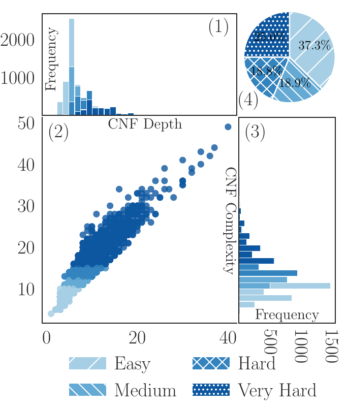
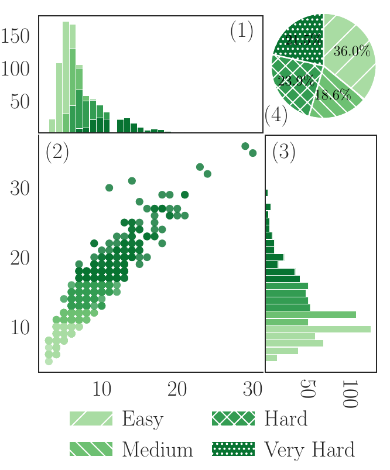
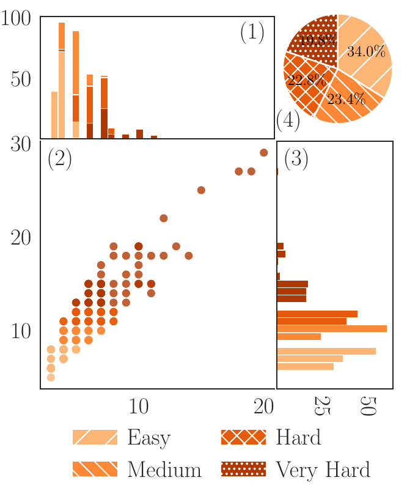

# Symbolic-JEPA: Where Symbolic AI Meets Joint-Embedding Predictive Architecture for NL–FOL Conversion

## 🏗 Repository Structure

The project is organized into modular phases representing the training and evaluation lifecycle:

- [ParaLogic-Dataset/](ParaLogic-Dataset/): The core data repository containing the structured data splits (`train.json`, `test.json`, `val.json`) used for training and evaluation.
- [pretrain_phase/](pretrain_phase/): Stage 1 training using the JEPA architecture. Focuses on joint embedding of NL and FOL with a masking task and auxiliary structural losses.
- [finetune_prep_phase/](finetune_prep_phase/): Data preparation for the fine-tuning stage. Parses FOL into trees and generates structural labels (**CPP** and **LDP**).
- [finetune_phase/](finetune_phase/): Stage 2 training. Fine-tunes a T5 model with structural heads for NL-to-FOL translation using multi-task supervised learning.
- [metric_eval/](metric_eval/): Comprehensive evaluation suite to assess translation quality across syntax, semantics, and logic.

---

## 📊 Para-Logic Dataset

### 📊 Dataset Statistics

This dataset is a paragraph-level corpus, where each sample corresponds to a short text segment containing one or more sentences.
Samples are categorized by the number of sentences per paragraph (1, 2, 3, or 4+), and divided into train, validation, and test splits.
Each split contains paired natural language (NL) and first-order logic (FOL) representations.

---

### 🧩 Overall Summary

<table>
  <thead>
    <tr>
      <th rowspan="2">Category</th>
      <th rowspan="2">No of Paragraph</th>
      <th colspan="4">Number of Sentences per Paragraph</th>
      <th rowspan="2">Total NL sentences</th>
      <th rowspan="2">Total FOL sentences</th>
    </tr>
    <tr>
      <th>1 Sent</th>
      <th>2 Sent</th>
      <th>3 Sent</th>
      <th>4+ Sent</th>
    </tr>
  </thead>
  <tbody>
    <tr>
      <td><strong>Total</strong></td>
      <td><strong>9344</strong></td>
      <td>3601</td>
      <td>1371</td>
      <td>1444</td>
      <td>2928</td>
      <td>28,617</td>
      <td>28,330</td>
    </tr>
    <tr>
      <td><strong>Train (80%)</strong></td>
      <td><strong>7478</strong></td>
      <td>2881</td>
      <td>1097</td>
      <td>1156</td>
      <td>2344</td>
      <td>22,915</td>
      <td>22,698</td>
    </tr>
    <tr>
      <td><strong>Validation (10%)</strong></td>
      <td><strong>933</strong></td>
      <td>360</td>
      <td>137</td>
      <td>144</td>
      <td>292</td>
      <td>2,860</td>
      <td>2,823</td>
    </tr>
    <tr>
      <td><strong>Test (10%)</strong></td>
      <td><strong>933</strong></td>
      <td>360</td>
      <td>137</td>
      <td>144</td>
      <td>292</td>
      <td>2,842</td>
      <td>2,809</td>
    </tr>
  </tbody>
</table>

---

## 🧠 Notes

- **No of Paragraph** = total number of samples = `1_sent + 2_sent + 3_sent + 4+_sent`.  
- **“1 Sent”, “2 Sent”, …** denote the count of samples (paragraphs) with that many NL sub-sentences.  
- **NL sentences**: Total count of all NL sub-sentences.  
- **FOL sentences**: Total count of all FOL sub-sentences.  
- Splits follow an **80 / 10 / 10** ratio for training, validation, and testing.

**We intentionally keep samples with a single sentence** to enable a curriculum learning strategy: models can be trained progressively — starting with 1-sentence examples, then moving to 2–3 sentence examples, and finally handling samples with 4 or more sentences. This gradual increase in complexity helps models learn robustly from simple to more complex contexts.

### 📐 Complexity & Difficulty Analysis

Figure 1 provides an overview of the CNF complexity distribution and its relationship with structural depth across the training, validation, and testing datasets.

<p align="center">
  
  
  
  <br>
  <em>Figure 1: Visualization of Depth, Complexity, Level Distribution and Correlation statistics across datasets.</em>
</p>

Each dataset split corresponds to one of the visualizations above. Within each, four schematic components are presented: 

1. **Bar charts** illustrating the CNF depth distributions.
2. **Bar charts** illustrating the CNF complexity distributions.
3. **Pie charts** showing the proportion of total instances across four difficulty levels.
4. **Scatter plots** depicting the correlation between CNF complexity and structural depth.

#### **Distribution & Complexity**

All splits exhibit a **right-skewed pattern**, with most formulas containing **8-20 clauses**, indicating that simpler logical structures dominate. Based on quartile thresholds of overall complexity, CNF instances are categorized into four levels:

| Difficulty Level | Mean Complexity Score | Proportion (%) |
| :--- | :--- | :--- |
| *Easy* | 3.7477 | 34 - 36% |
| *Medium* | 4.9071 | 17 - 20% |
| *Hard + Very Hard* | 6.4479 - 10.6203 | 45 - 48% |

#### **Structural Correlation**

CNF complexity and tree depth exhibit a strong positive correlation across all splits, with Spearman coefficients (ρ) between 0.917 and 0.927. This suggests that deeper formulas generally have higher symbolic complexity, and the consistent trend across splits confirms the dataset’s reliability in modeling reasoning difficulty.

---

## 🗂️ JSON Summary (for reference)

```json
{
  "Total": {
    "1 sentence": 3601,
    "2 sentences": 1371,
    "3 sentences": 1444,
    "4 or more sentences": 2928,
    "total NL sentences": 28617,
    "total FOL sentences": 28330
  },
  "train": {
    "1 sentence": 2881,
    "2 sentences": 1097,
    "3 sentences": 1156,
    "4 or more sentences": 2344,
    "total NL sentences": 22915,
    "total FOL sentences": 22698
  },
  "val": {
    "1 sentence": 360,
    "2 sentences": 137,
    "3 sentences": 144,
    "4 or more sentences": 292,
    "total NL sentences": 2860,
    "total FOL sentences": 2823
  },
  "test": {
    "1 sentence": 360,
    "2 sentences": 137,
    "3 sentences": 144,
    "4 or more sentences": 292,
    "total NL sentences": 2842,
  }
}
```

## 📥 Download Pre-processed Datasets

Pre-processed datasets for both pretraining and fine-tuning phases are available for download at the link below:

**[Download Processed Datasets (OneDrive)](https://1drv.ms/f/c/b75bec574f5e22fe/IgCH_qo1qS1mQagfL3yjHGTEAdFtIEmfq0_JSdqFRrksvBE?e=B7qQ2d)**

---

## 📊 Data Specifications

### 1. Pretraining Data (`pretrain_phase`)

The pretraining phase uses a rich JSONL format that includes path-level structural information for both NL and FOL.

- **Format**: `.jsonl`
- **Key Fields**:
  - `topic`: A unique ID for the logic sample.
  - `ast_fol`: Contains the FOL expression, its tokens, and **structural paths** (type paths and value paths) representing the logic tree hierarchy.
  - `ast_nl`: Similar to `ast_fol`, but for the Natural Language sentence, aligning linguistic components with logic tree nodes.

- **Preview Case**:

    ```json
    {
      "topic": 1,
      "ast_fol": [{
        "expression": "( FORALL x ( person(x) -> program(x) ) )",
        "tokens": [["(", 0], ["FORALL", 1], ...],
        "type_paths": [{"current_node": "FORALL", "paths": ["FORALL"], "path_ids": [1]}, ...],
        "value_paths": [...]
      }],
      "ast_nl": [...]
    }
    ```

    *For more details on data formats and complex examples, please refer to the `data/` or `output/` directories in each phase, such as `pretrain_phase/data/`.*

### 2. Fine-tuning Structural Supervision (`.npz`)

The `finetune_prep_phase` generates structural labels stored in Compressed NumPy files (`.npz`), which provide the necessary conditional structural awareness for the decoders.

#### **Compositional Path Prediction (CPP)** (`*_cpp_paths.npz`)

This leverages the **Structure-Aware Node & Path Encoder (SANE)** representation to encode the hierarchical path from root to leaf for every token in the FOL formula.

- `topic_ids`: (N,) - Mapping to the main dataset.
- `labels`: (N, L) - Target token IDs for the decoder.
- `cpp_paths`: (N, L, Depth) - The structural "coordinate" of each token in the logic tree based on the SANE architecture.
- `type_vocab_keys/vals`: Vocab mapping for structural node types (e.g., Predicate, Variable, Quantifier).

#### **Logical Dependency Prediction (LDP)** (`*_ldp_links.npz`)

This captures the logical dependencies and variable flow within the formula to enforce semantic constraints.

- `ldp_links`: (N, L, L) - Adjacency matrix of logical dependencies (Logic Data Paths).
- `ldp_edges`: (N, E, 2) - Explicit list of (source, destination) edges for variable binding (e.g. Predicate$\rightarrow$Argument edges).
- `tokens`: (N, L) - Tokens aligned with the Tokenizer pieces.
- `token_predicate_id`: (N, L) - Local IDs identifying tokens referring to specific logical predicates.

- **Preview Case (Input JSON)**:

    ```json
    [
      {
        "topic": 1,
        "nl": "A person is considered a programmer if they can write computer code",
        "fol": "(FORALL x (person(x) AND can_write_code(x) IMPLIES program(x)))"
      }
    ]
    ```

    *For more details on how these records are paired with structural labels, check `finetune_phase/data/`.*

---

## ⚖️ Metrics & Evaluation

Evaluation consists of three complementary dimensions:

1. **Well-formedness**: Validates if the generated FOL string is syntactically correct and parsable.
2. **Semantic Score**: Measures linguistic similarity between the generated and reference FOL using metrics like **BLEU** or **BERTScore**.
3. **Logic Score**: The most critical metric, assessing structural equivalence using FOL tree matching or SMT solvers to verify if the generated formula is logically identical to the ground truth.

---

## 🚀 Getting Started

### 1. Environment Setup

The project relies on two main Conda environments to separate training libraries from evaluation dependencies.

Create and activate the environments (requires Python 3.10+):

```bash
# 1. Training Environment
conda create -n logic_jepa python=3.10
conda activate logic_jepa
pip install -r requirements.txt

# 2. Evaluation Environment (contains specific logic parsing and NLP dependencies)
conda create -n env_metric python=3.10
conda activate env_metric
pip install -r requirements.txt
```

### 2. Auto-Run the Full Pipeline

You can orchestrate the entire workflow (from pre-training to evaluation) using the master script:

```bash
bash script_run.sh
```

### 3. Running Phases Manually

If you want to run or modify specific parts of the architecture, navigate to each module:

#### Step 1: Data Preparation (Structural Labeling)

Generate structure labels (CPP and LDP) for fine-tuning.

```bash
conda activate logic_jepa
cd finetune_prep_phase
bash run_pipeline.sh --input data/sample.json --output_dir output/
```

#### Step 2: Pre-training (Symbolic-JEPA Encoder)

Pre-train the JEPA encoder to learn joint embeddings for NL and FOL.

```bash
cd pretrain_phase
python main.py
```

#### Step 3: Fine-tuning (Logic-Structured Decoder)

Fine-tune the T5 model using the pre-trained encoder and structural auxiliary heads.

```bash
cd finetune_phase
python main.py
```

#### Step 4: Inference

Generate FOL sequences from Natural Language.

```bash
cd finetune_phase
python inference.py --dataset_path data/test.json --preset B
```

#### Step 5: Evaluation

Evaluate the inference results against reference FOL using Syntactic, Semantic, and Logic scores.

```bash
conda activate env_metric
cd metric_eval
python main.py --input ../finetune_phase/inference_results/test.json --output results_metrics/test.json --lambda1 0.5 --lambda2 0.5
```
